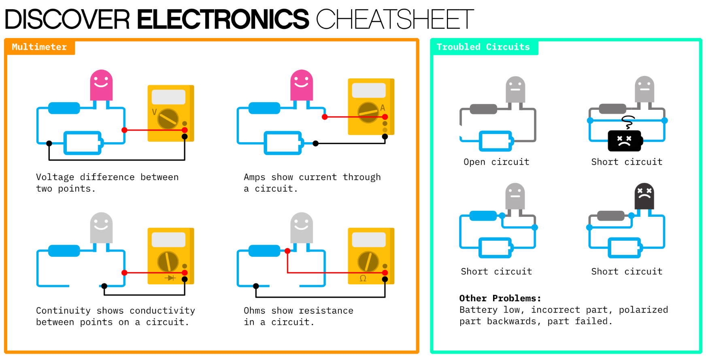

## Intro

circuitPython and adafruit

- [Getting Started with Raspberry Pi Pico and CircuitPython](https://learn.adafruit.com/getting-started-with-raspberry-pi-pico-circuitpython)
- [Welcome to circuitPython](https://learn.adafruit.com/welcome-to-circuitpython/exploring-your-first-circuitpython-program)
- [Quick-Start the Pico W WiFi with CircuitPython](https://learn.adafruit.com/pico-w-wifi-with-circuitpython)


## Install CircuitPython on the Raspberry Pi PICO.

1. Hold down the button and plug it in.
2. A new drive should pop up.
3. Drag the .UF2 file over
4. A circuitpy drive should pop up

[circuitPython for Raspberry Pi PICO](https://circuitpython.org/board/raspberry_pi_pico_w/)

## Set up your development environment

You need a code editor and a way to read the serial port.

- (Code with Mu)[https://codewith.mu/]
- VS Code with the circuitPython plugin
- Any code editor a _screen_ running in a terminal.

### Reading the serial port in the terminal

[Advanced Serial Console on Linux](https://learn.adafruit.com/welcome-to-circuitpython/advanced-serial-console-on-linux)

```
$ ls /dev/ttyACM*

$ screen /dev/ttyACM0 115200
```

## Programming your PICO

Edit the _code.py_ on your pico.
Saving the file will run the code.

```
print("Hello, world!")
```

You will see the output in the serial port monitor.

### Blink the on-board LED

```
import time
import board
import digitalio

led = digitalio.DigitalInOut(board.LED)
led.direction = digitalio.Direction.OUTPUT

pause = 0.5

while True:
    led.value = True
    time.sleep(pause)
    led.value = False
    time.sleep(pause)
```

## The Solderless Breadboard

Power your breadboard

- breadboard
- pico
- USB mini cable
- jumper wires
- led
- 220 resistor


## Electricity

  - Short circuit / broken circuit
  - Circuit testing

  
  

## External LED

- led
- 220 resistor

LEDs can easily burn out if subjected to too much current.
Electricity can only flow in one direction through an LED.


```
import time
import board
import digitalio

led = digitalio.DigitalInOut(board.LED)
led.direction = digitalio.Direction.OUTPUT

extled = digitalio.DigitrlInOut(board.GP18)
extled.direction = digitalio.Direction.OUTPUT

pause = 0.1

while True:
    extled.value = True
    time.sleep(pause)
    extled.value = False
    time.sleep(pause)
```

## Button / Touch Sensor

```
import board
import digitalio

extled = digitalio.DigitalInOut(board.GP18)
extled.direction = digitalio.Direction.OUTPUT
button = digitalio.DigitalInOut(board.GP16)
button.switch_to_input(pull=digitalio.Pull.DOWN)

while True:
    if button.value:
        led.value = True
    led.value = False
```

[Capacitive Touch Sensor](parts/captouch_sensor/captouch_sensor.md)

## Adafruit Software Libraries

[CircuitPython Libraries](https://circuitpython.org/libraries)

## Peripherals 
### Neopixel
[parts/neopixel.md](parts/neopixel/neopixel.md)
### OLED screen
[parts/display.md](parts/display/display.md)
### RealTimeClock
[parts/realTimeClock](parts/realTimeClock/realTimeClock_ds3231.md)
### Ultra Sonic Sensor
[parts/ultrasonic_sensor](parts/ultrasonic_sensor/ultrasonic_sensor.md)


## Moving forward

- Pulse Width Modulation
  - Fade an LED
- Analgo in
  - Light sensor
- [parts/RGB_LED](parts/RGB_LED/rgb_led.md)
- Audio
  - [parts/piano](parts/piano.md)

[Cooperative Multitasking in circuitPython with Asyncie](https://learn.adafruit.com/cooperative-multitasking-in-circuitpython-with-asyncio)

[AdafruitIO](parts/adafruitio/adafruitio.md)
