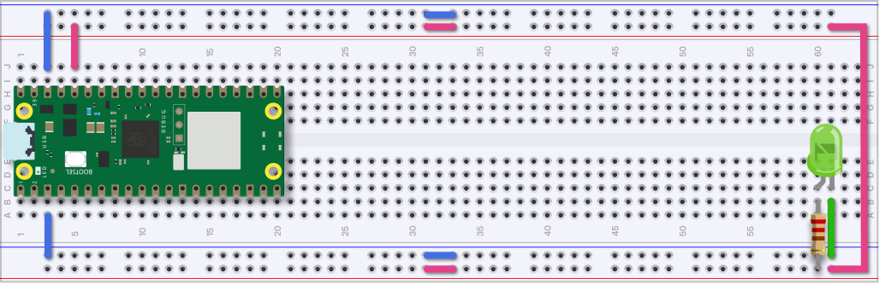

# Emerging Objects Notes

## outline

1. The solderless breadboard
2. Electricity
  - Short circuit / broken circuit
  - multimeter
3. Power your breadboard
   - LED circuit
4. Set up your development environment
  - Mu editor
  - VB w/ circuitPython plugin
  - Any code editor w/ screen
5. PICO overview
6. Code overviev
  - circuitPython
  - libraries, set up, loop
  - print
7. Setting up pins
8. Blink an LED
9. Button (touch sensor)
10. Pulse Width Modulation
11. analog in
12. Downloading more libraries
13. Neopixels
14. screen
15. realtime clock (i2c)
15. ultrasonic sensor

----

## Intro

- [Getting Started with Raspberry Pi Pico and CircuitPython](https://learn.adafruit.com/getting-started-with-raspberry-pi-pico-circuitpython)
- [Quick-Start the Pico W WiFi with CircuitPython](https://learn.adafruit.com/pico-w-wifi-with-circuitpython)


## The Solderless Breadboard

Power your breadboard

- breadboard
- pico
- USB mini cable
- jumper wires
- led
- 220 resistor



## Electricity

  - Short circuit / broken circuit
  - Circuit testing

  
  

## Install CircuitPython on the Raspberry Pi PICO.

1. Hold down the button and plug it in.
2. A new drive should pop up.
3. Drag the .UF2 file over
4. A circuitpy drive should pop up

[circuitPython for Raspberry Pi PICO](https://circuitpython.org/board/raspberry_pi_pico_w/)

## Set up your development environment

You need a code editor and a way to read the serial port.

- (Code with Mu)[https://codewith.mu/]
- VS Code with the circuitPython plugin
- Any code editor a _screen_ running in a terminal.

### Reading the serial port in the terminal

[Advanced Serial Console on Linux](https://learn.adafruit.com/welcome-to-circuitpython/advanced-serial-console-on-linux)

```
$ ls /dev/ttyACM*

$ screen /dev/ttyACM0 115200
```

## Programming your PICO

Edit the _code.py_ on your pico.
Saving the file will run the code.

```
print("Hello, world!")
```

You will see the output in the serial port monitor.

### Blink the on-board LED

```
import time
import board
import digitalio

led = digitalio.DigitalInOut(board.LED)
led.direction = digitalio.Direction.OUTPUT

pause = 0.5

while True:
    led.value = True
    time.sleep(pause)
    led.value = False
    time.sleep(pause)
```

## External LED

- led
- 220 resistor

## Adafruit Software Libraries

[CircuitPython Libraries](https://circuitpython.org/libraries)
