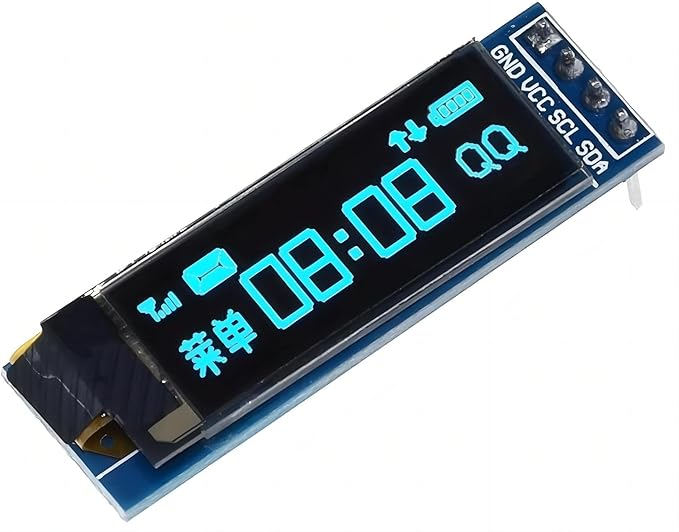
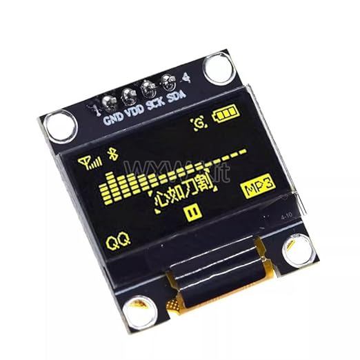
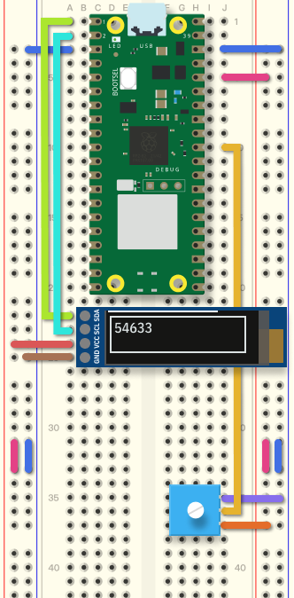
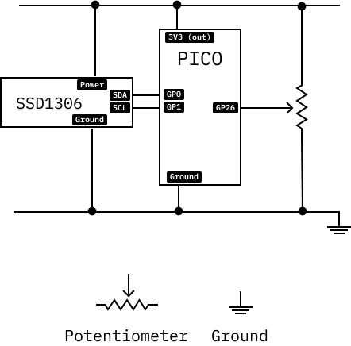

# Display

SSD1306 Oled displays are small and inexpensive.

 

In this example, the value of a potentiometer is shown on the display.

```python
# SPDX-FileCopyrightText: 2021 ladyada for Adafruit Industries
# Small edits for Raspberry Pi Pico by Ariel Churi
# SPDX-License-Identifier: MIT

"""
This test will initialize the display using displayio and draw a solid white
background, a smaller black rectangle, and some white text.
"""

import board
import busio
import displayio

# For the potentiometer.
import analogio
potentiometer = analogio.AnalogIn(board.GP26)

from i2cdisplaybus import I2CDisplayBus

import terminalio
from adafruit_display_text import label
import adafruit_displayio_ssd1306

displayio.release_displays()

i2c = busio.I2C(board.GP1, board.GP0)  
display_bus = I2CDisplayBus(i2c, device_address=0x3C)
display = adafruit_displayio_ssd1306.SSD1306(display_bus, width=128, height=32)

# Make the display context
splash = displayio.Group()
display.root_group = splash

color_bitmap = displayio.Bitmap(128, 32, 1)
color_palette = displayio.Palette(1)
color_palette[0] = 0xFFFFFF  # White

bg_sprite = displayio.TileGrid(color_bitmap, pixel_shader=color_palette, x=0, y=0)
splash.append(bg_sprite)

# Draw a smaller inner rectangle
inner_bitmap = displayio.Bitmap(118, 24, 1)
inner_palette = displayio.Palette(1)
inner_palette[0] = 0x000000  # Black
inner_sprite = displayio.TileGrid(inner_bitmap, pixel_shader=inner_palette, x=5, y=4)
splash.append(inner_sprite)

# Draw a label
text = "Hello World!"
text_area = label.Label(terminalio.FONT, text=text, color=0xFFFF00, x=28, y=15)
splash.append(text_area)

while True:
    text_area.text = str(potentiometer.value)
```




