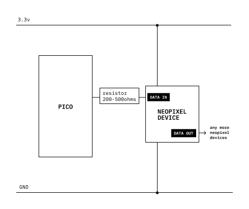

# Neopixel

Neopixel the brand name of a series of LED products from Adafruit.
They are RGB LEDs that have a chip inside that handles the PWM (pulse width modulation) that creates the color.
You can send a code for the color to the Neopixel and it wil show the color.

Neopixels can be linked in a chain so that you can control many Neopixels with a single pin or your microcontroler.
There are a variety of Neopixel products and there may be small differences between how they are used.
Each Neopixel draws a small amount of power.
A large number of Neopixels could use a lot of power and require changes to your circuit.

You can use the neopixel library from Adafruit to control your neopixels.
Download the library ([circuitPython Library Bundle](https://circuitpython.org/librarieshttps://circuitpython.org/libraries)) and copy the _neopixel.py_ file to your Pico's _lib_ folder.



## Links

- [Neopixel uber guide](https://learn.adafruit.com/adafruit-neopixel-uberguide)
- [NeoPIO: Drive lots of LEDs](https://learn.adafruit.com/neopio-drive-lots-of-leds-with-raspberry-pi-pico) 
- [NeoPixel Ring Lamp](https://learn.adafruit.com/neopixel-ring-lamp) 

## CircuitPython

```python
import time
import board
import neopixel # This is a library that must be installed in your PICO's "lib" folder.
# Libraries can be downloaded here: https://circuitpython.org/libraries. Find the neopixel.py file and copy it into your pico's "lib" folder.
pixels = neopixel.NeoPixel(board.GP22, 5)    # This is the pin for your Neopixels and the number of LEDs in the chain.

pause = 0.5

while True:
    pixels.fill((0, 255, 0)) # You can send three numbers from 0 to 255.
    time.sleep(pause)
    pixels.fill((255, 0, 0)) # It could be red, green, blue or green, red, blue.
    time.sleep(pause)
    pixels.fill((0, 0, 255)) # The "fill" command sends the color to all of the LEDs in the line.
    time.sleep(pause)
    pixels[0] = (255, 255, 255) # This effects only the first pixel in the chain.
    time.sleep(pause)
```

### Named colors

```python
import board
import neopixel
pixels = neopixel.NeoPixel(board.GP22, 1)    # Change the 1 for more LEDs

pause = 0.5

red = (0, 255, 0)
orange = (75, 255, 0)
yellow = (200, 255, 0)
green = (255, 0, 0)
blue =  (0, 0, 255)
purple = (0, 50, 255)
magenta = (0, 255, 255)
cyan = (255, 0, 255)
white = (255, 255, 255)
black = (0, 0, 0)

while True:
    pixels.fill(red)
    time.sleep(pause)
    pixels.fill(orange)
    time.sleep(pause)
    pixels.fill(yellow)
    time.sleep(pause)
    pixels.fill(green)
    time.sleep(pause)
    pixels.fill(cyan)
    time.sleep(pause)
    pixels.fill(blue)
    time.sleep(pause)
    pixels.fill(purple)
    time.sleep(pause)
    pixels.fill(magenta)
    time.sleep(pause)
```

### LED back and forth

```python
import time
import board
import neopixel # This is a library that must be installed in your PICO's "lib" folder.

pixelLength = 5
pixelColor1 = (0, 100, 255)
pixelColor2 = (5, 0, 20)
pixels = neopixel.NeoPixel(board.GP22, pixelLength)    # This is the pin for your Neopixels and the number of LEDs in the chain.

pause = 0.1

pixels.fill(pixelColor2)

while True:
    # Forward animation
    for i in range(pixelLength):
        pixels[i] = pixelColor1  # Turn current pixel on
        if i > 0:
            pixels[i-1] = pixelColor2  # Turn previous pixel off
        time.sleep(pause)  # Pause for a specified time
    # Reverse animation
    for i in range(pixelLength-1, -1, -1):
        pixels[i] = pixelColor1  # Turn current pixel on
        if i < pixelLength-1:
            pixels[i+1] = pixelColor2  # Turn next pixel off
        time.sleep(pause)  # Pause for a specified timeimport time
```
